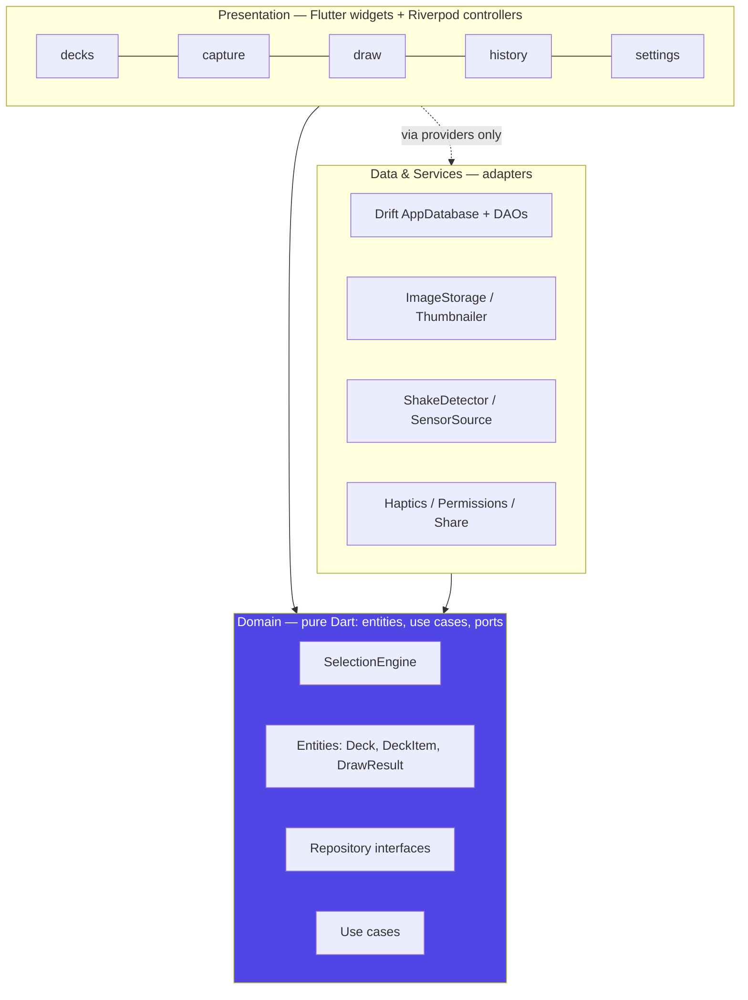
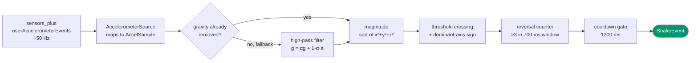
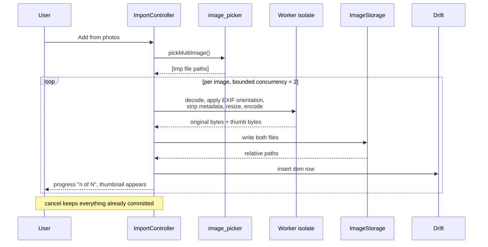
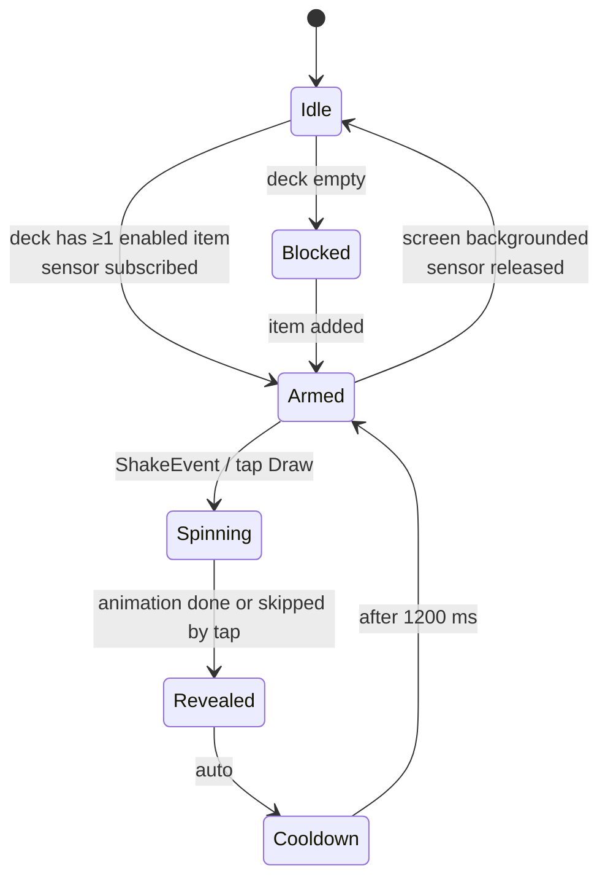

# Architecture — Shake It Up

| Field | Value |
|---|---|
| Document version | 1.0 (draft for review) |
| Companion | [`SRS.md`](./SRS.md) — what the app must do |
| Scope | Technical design for v1.0, pre-implementation |
| Last updated | 2026-08-14 |

---

## 1. Architectural goals

Five properties drive every decision below.

1. **The core loop is sacred.** Shake → result must be fast, reliable, and never ambiguous.
   Everything else is supporting cast.
2. **Physics logic is pure Dart.** Shake recognition and random selection are the two places this
   app can actually be wrong. Both are plain Dart with injected inputs (sensor stream, clock, RNG),
   so both are fully testable on CI with no device and no flake.
3. **Offline and private by construction.** No network layer exists to accidentally leak through.
4. **Storage owns its bytes.** The app copies every image it accepts and stores relative paths, so
   nothing breaks when the user deletes the source photo or the OS moves the app container.
5. **The sensor is a leased resource.** Subscribed only while a draw screen is foregrounded,
   released everywhere else.

---

## 2. Technology choices

| Concern | Choice | Why |
|---|---|---|
| Framework | Flutter (stable), Dart 3 | One codebase, native-feeling animation and haptics |
| State management | **Riverpod** (`Notifier` / `AsyncNotifier`) | Compile-safe DI, trivially overridable in tests, no `BuildContext` coupling in logic |
| Navigation | **go_router** | Declarative routes, typed params, deep-link ready |
| Local database | **Drift** over SQLite | Typed queries, first-class migrations, `Stream` queries drive reactive UI |
| Sensors | **sensors_plus** | Maintained, gives gravity-compensated user acceleration |
| Image acquisition | **image_picker** | Wraps the *system* pickers → multi-select, no broad library permission |
| Image processing | **flutter_image_compress** (+ `image` as fallback) | Native resize/encode, keeps work off the UI isolate |
| Permissions | **permission_handler** | Camera only; includes the "open app settings" deep link |
| Paths | **path_provider**, **path** | App-private directories, portable joins |
| IDs / hashing | **uuid**, **crypto** | v4 item IDs, SHA-256 content hash for duplicate detection |
| Haptics | Flutter `HapticFeedback` | No extra dependency needed |
| Localisation | `flutter_localizations` + ARB | EN + AR with RTL |
| Lint | `flutter_lints` (strict mode on) | |
| Test | `flutter_test`, `mocktail`, `integration_test`, golden tests | |

> Versions are deliberately not pinned in this document — pin them in `pubspec.yaml` at scaffold
> time and let Dependabot move them. No package here is load-bearing enough to be hard to replace;
> `sensors_plus` is the only one with no trivial substitute, and it sits behind our own interface
> (§4.1) precisely for that reason.

**Deliberately absent:** any HTTP client, any analytics/crash SDK (v1.0), any custom camera preview
(the system camera activity is faster to ship and better tested than a bespoke `CameraController` UI).

---

## 3. Layers and modules

Three layers, dependencies pointing strictly inward. The domain layer imports nothing from Flutter.



The dotted edge matters: presentation never constructs a data-layer object directly, it reads a
Riverpod provider whose type is a **domain interface**. Swapping Drift for something else, or
faking the sensor in a widget test, is a one-line provider override.

### 3.1 Folder structure

```
lib/
  main.dart                        # bootstrap: DI container, error zone, runApp
  app/
    app.dart                       # MaterialApp.router, theme, localisation
    router.dart                    # go_router route table
    theme/                         # Material 3 color schemes, typography, motion tokens
  core/
    result.dart                    # Result<T, Failure> — no exceptions across layer edges
    failure.dart                   # sealed Failure hierarchy
    clock.dart                     # injectable time source
    random_source.dart             # injectable RNG
    extensions/ constants/
  domain/
    entities/                      # Deck, DeckItem, DrawResult, SelectionMode, ShakeEvent
    repositories/                  # abstract DeckRepository, HistoryRepository, ...
    services/                      # abstract ShakeDetector, ImageStore, Haptics
    draw/
      selection_engine.dart        # THE randomness. Pure. Deterministic under a seeded RNG
      shake_recognizer.dart        # THE gesture. Pure. Consumes samples, emits ShakeEvent
    usecases/                      # DrawFromDeck, ImportImages, DeleteDeck, ResetBag, ...
  data/
    db/
      app_database.dart            # Drift database + migrations
      tables.dart  daos/           # Decks, Items, Draws, BagState
      mappers.dart                 # row <-> entity
    repositories/                  # concrete implementations of domain interfaces
    storage/
      image_storage.dart           # copy-in, delete, resolve relative -> absolute
      thumbnailer.dart             # resize/encode, runs off the UI isolate
      exif.dart                    # orientation applied, GPS stripped
  services/
    sensors/
      accelerometer_source.dart    # sensors_plus adapter -> Stream<AccelSample>
      shake_detector_impl.dart     # ShakeRecognizer + lifecycle + cooldown
    haptics_service.dart  permission_service.dart  share_service.dart
  features/
    decks/    capture/   draw/   history/   settings/
      # each: presentation/screens, presentation/widgets, presentation/controllers
l10n/  app_en.arb  app_ar.arb
test/            # mirrors lib/
integration_test/
```

---

## 4. Shake detection design

This is the highest-risk component in the app: too sensitive and the app fires while the user walks;
too dull and the product feels broken. It is therefore split into a **pure recognizer** (all the
logic, no I/O) and a **thin adapter** (sensor subscription and lifecycle).

### 4.1 Pipeline



### 4.2 Algorithm

```dart
/// Pure. No Flutter, no plugins, no wall-clock reads — the timestamp arrives with the sample.
class ShakeRecognizer {
  ShakeRecognizer({
    this.threshold = 12.0,                                 // m·s⁻², gravity-free magnitude
    this.minReversals = 3,
    this.window = const Duration(milliseconds: 700),
    this.cooldown = const Duration(milliseconds: 1200),
    this.minGapBetweenCrossings = const Duration(milliseconds: 80),
  });

  final _crossings = Queue<_Crossing>();                   // (timestamp, dominantAxis, sign)
  Duration? _lastFiredAt;

  /// Returns true exactly once per recognised shake.
  bool add(AccelSample s) {
    if (_lastFiredAt != null && s.t - _lastFiredAt! < cooldown) return false;

    final m = s.magnitude;
    if (m < threshold) return false;                       // below the bar: ignore

    final axis = s.dominantAxis;                           // x, y or z — largest |component|
    final sign = s.componentSign(axis);
    final last = _crossings.lastOrNull;

    // Debounce sensor chatter, and only count a *reversal* — same axis, opposite direction.
    if (last != null) {
      if (s.t - last.t < minGapBetweenCrossings) return false;
      if (last.axis == axis && last.sign == sign) return false;
    }

    _crossings.add(_Crossing(s.t, axis, sign));
    while (_crossings.isNotEmpty && s.t - _crossings.first.t > window) {
      _crossings.removeFirst();                            // slide the window
    }

    if (_crossings.length >= minReversals) {
      _crossings.clear();
      _lastFiredAt = s.t;
      return true;
    }
    return false;
  }
}
```

**Why reversals rather than a magnitude threshold alone.** A single spike is what happens when a
phone is set down on a table, dropped into a bag, or bumped in a pocket. A shake is *oscillation*.
Requiring three sign-flipped crossings on the dominant axis inside 700 ms cleanly separates the two,
and it is the rule that satisfies FR-23.

**Sensitivity presets (FR-25)** map only to `threshold`: Low 15.0, Medium 12.0, High 9.0 m·s⁻².
Nothing else is user-tunable — one dial the user can reason about.

**Gravity.** `sensors_plus` exposes `userAccelerometerEvents`, already gravity-compensated by the
platform's sensor fusion. The adapter prefers it; if a device delivers nothing on that stream within
a short probe, it falls back to raw `accelerometerEvents` with a first-order high-pass filter
(`α = 0.85`) and reports the fallback in the calibration screen's debug readout.

### 4.3 Lifecycle (NFR-06)

The detector is owned by a Riverpod provider that is **auto-disposed with the draw route**. It also
listens to `AppLifecycleState` and cancels on `inactive`/`paused`, resubscribing on `resumed`.
`ref.onDispose(subscription.cancel)` makes leaking the subscription structurally difficult. Net
effect: no accelerometer listener exists anywhere except while the user is looking at a draw screen.

### 4.4 Testing the untestable part

`ShakeRecognizer.add()` takes samples with explicit timestamps, so tests replay traces at arbitrary
speed with no timers:

- **Positive traces** — real shakes recorded from ≥3 device classes, exported as CSV fixtures.
- **Negative traces** — phone set down hard, walking, running, car ride, typing, pocket transfer.
  Each asserts *zero* events.
- **Property tests** — one continuous 5 s shake fires exactly ⌊5000/1200⌋ times, never more.
- **Boundary** — samples exactly at threshold, out-of-order timestamps, an empty stream.

A `--debug-shake` build flag renders a live magnitude/threshold chart for field tuning.

---

## 5. Selection engine

The second place this app can be quietly wrong. Also pure, also deterministic under test.

```dart
abstract class RandomSource { int nextInt(int max); }      // seeded in tests, Random() in prod

class SelectionEngine {
  DrawOutcome draw({
    required List<ItemId> enabled,     // disabled items are filtered out before this call
    required SelectionMode mode,
    required ItemId? lastWinner,
    required List<ItemId> bag,         // persisted remaining pool, shuffle-bag mode only
  });
}
```

| Mode | Rule | Notes |
|---|---|---|
| `pureRandom` | `enabled[rng.nextInt(enabled.length)]` | Independent draws; repeats possible and correct |
| `noImmediateRepeat` *(default)* | Draw from `enabled - {lastWinner}` when `enabled.length >= 2` | Matches what users *mean* by random (SRS R-2) |
| `shuffleBag` | Draw without replacement from `bag`; when empty, refill with a fresh Fisher–Yates shuffle of `enabled` | Persisted per deck; invalidated when the enabled set changes (FR-32) |

**Invariants enforced by tests:** exactly one winner returned; the winner is always enabled;
`noImmediateRepeat` never returns `lastWinner` while ≥2 items are enabled; a shuffle bag returns
every item exactly once per cycle; uniformity within ±3 % over 10 000 draws (FR-36).

Shuffle-bag state persists in its own table rather than as a blob on the deck row, so a bag refill
and a deck edit can't clobber each other.

---

## 6. Data layer

### 6.1 Physical schema (Drift / SQLite)

```sql
CREATE TABLE decks (
  id              TEXT PRIMARY KEY,
  name            TEXT NOT NULL,
  selection_mode  TEXT NOT NULL DEFAULT 'noImmediateRepeat',
  last_winner_id  TEXT REFERENCES items(id) ON DELETE SET NULL,
  created_at      INTEGER NOT NULL,
  updated_at      INTEGER NOT NULL
);

CREATE TABLE items (
  id            TEXT PRIMARY KEY,
  deck_id       TEXT NOT NULL REFERENCES decks(id) ON DELETE CASCADE,
  original_path TEXT NOT NULL,          -- RELATIVE to app documents dir
  thumb_path    TEXT NOT NULL,          -- RELATIVE
  label         TEXT,
  enabled       INTEGER NOT NULL DEFAULT 1,
  position      INTEGER NOT NULL,
  content_hash  TEXT,                   -- sha256, duplicate detection
  created_at    INTEGER NOT NULL
);
CREATE INDEX idx_items_deck   ON items(deck_id, position);
CREATE INDEX idx_items_active ON items(deck_id, enabled);

CREATE TABLE draws (
  id        TEXT PRIMARY KEY,
  deck_id   TEXT NOT NULL REFERENCES decks(id) ON DELETE CASCADE,
  item_id   TEXT NOT NULL REFERENCES items(id) ON DELETE CASCADE,
  drawn_at  INTEGER NOT NULL,
  trigger   TEXT NOT NULL              -- 'shake' | 'tap'
);
CREATE INDEX idx_draws_deck ON draws(deck_id, drawn_at DESC);

CREATE TABLE bag_state (                -- shuffle-bag remaining pool
  deck_id   TEXT NOT NULL REFERENCES decks(id) ON DELETE CASCADE,
  item_id   TEXT NOT NULL REFERENCES items(id) ON DELETE CASCADE,
  ord       INTEGER NOT NULL,
  PRIMARY KEY (deck_id, item_id)
);
```

`PRAGMA foreign_keys = ON` is set on open — Drift does not enable it by default, and every cascade
above depends on it.

### 6.2 File layout

```
<app documents>/decks/<deckId>/orig/<itemId>.jpg      # ≤2048 px long edge, JPEG q85
<app documents>/decks/<deckId>/thumb/<itemId>.jpg     # 512 px long edge, JPEG q80
```

**Relative paths only.** The database stores `decks/<deckId>/orig/<itemId>.jpg`; absolute paths are
resolved at read time against `getApplicationDocumentsDirectory()`. This is not fussiness — the iOS
app-container UUID changes across installs and OS updates, so any absolute path persisted today is a
broken image tomorrow. (ADR-005.)

### 6.3 Write ordering and orphan sweep

Import order is: **write file → verify → insert row**. A crash before the insert leaves an orphan
file, never a row pointing at nothing — the far friendlier failure (NFR-11). A startup sweep,
throttled to once per day, deletes files under `decks/` with no matching row and marks rows whose
file is missing as `missing`, which the UI renders as a placeholder and the draw filter excludes
(NFR-12).

Deck deletion is: cascade rows in a transaction → delete the deck directory → the sweep catches
anything the OS refused to remove.

### 6.4 Migrations

Drift's `MigrationStrategy` with a numbered `schemaVersion`, one migration step per released schema,
and a schema-fixture test per version that opens a real v(N-1) database file and asserts a clean
upgrade (NFR-13). Migration code is never edited after release — only appended to.

---

## 7. Image import pipeline

Import is the only heavy CPU work in the app, and it must never touch the UI isolate (NFR-05).



- **Concurrency is capped at 2** in-flight images. Unbounded parallel decode is the classic way to
  OOM a mid-range phone on a 40-photo import.
- `flutter_image_compress` does its work natively off the platform's main thread; the `image`
  package fallback runs under `Isolate.run` so the UI isolate stays free either way.
- Per-image failures are collected and surfaced as "2 of 12 couldn't be imported" without aborting
  the batch (FR-14).
- EXIF orientation is **applied to pixels**, then all metadata is dropped — this both fixes sideways
  photos and satisfies the GPS-stripping requirement (NFR-23).

---

## 8. State management and the draw state machine

Riverpod providers, one controller per screen, all business logic behind domain interfaces.

```dart
final accelerometerProvider   = StreamProvider.autoDispose<AccelSample>(...);
final shakeDetectorProvider   = Provider.autoDispose<ShakeDetector>(...);   // disposed with route
final selectionEngineProvider = Provider<SelectionEngine>(...);
final randomSourceProvider    = Provider<RandomSource>((_) => DartRandomSource());  // seeded in tests
final deckRepositoryProvider  = Provider<DeckRepository>(...);
final drawControllerProvider  =
    NotifierProvider.autoDispose.family<DrawController, DrawState, DeckId>(DrawController.new);
```

The draw screen is an explicit state machine — the fastest way to get double-fires, "stuck spinning"
bugs, and animation races is to model it with loose booleans.



Only `Armed` accepts a trigger. The cooldown lives in *both* the recognizer and the state machine —
the recognizer's protects against sensor-level double-fire, the machine's protects against a tap and
a shake landing together.

---

## 9. Cross-cutting concerns

### 9.1 Errors

Layer boundaries return `Result<T, Failure>`; exceptions do not cross them. `Failure` is sealed —
`StorageFull`, `PermissionDenied`, `PermissionPermanentlyDenied`, `FileMissing`, `DecodeFailed`,
`SensorUnavailable`, `DatabaseFailure` — so every UI switch over it is exhaustive at compile time,
and no failure can silently become a generic "something went wrong". `runZonedGuarded` in `main.dart`
catches anything that escapes.

### 9.2 Permissions

Requested contextually, never at launch (FR-51). Camera is the only runtime permission; the photo
picker needs none. Permanent denial routes to a screen explaining the consequence with an
`openAppSettings()` button (FR-52). `SensorUnavailable` degrades to tap-only mode (FR-34) — it is a
supported state, not an error dialog.

### 9.3 Accessibility

Semantic labels on every control; the result reveal announces through a live region (NFR-18);
`MediaQuery.disableAnimations` collapses the suspense reel to a fade (FR-41); the Draw button is a
first-class, always-visible control rather than a fallback tucked in a menu (NFR-14).

### 9.4 Theming and localisation

Material 3 with light/dark schemes and dynamic colour where the platform offers it. Motion durations
live in theme tokens so reduce-motion scales them in one place. All strings in ARB files; EN and AR
ship in v1.0, with `Directionality` handled by the framework and verified by RTL golden tests.

### 9.5 Performance

`GridView.builder` with `cacheExtent` tuned to one screen; thumbnails loaded via `ResizeImage` at
display size and capped in `PaintingBinding.imageCache`; full-resolution originals decoded only in
the viewer and the result screen, and evicted on pop; Drift `Stream` queries so the grid rebuilds
only on real row changes.

---

## 10. Testing strategy

| Level | Coverage | Tools |
|---|---|---|
| **Unit — pure domain** | `ShakeRecognizer` against recorded positive/negative traces; `SelectionEngine` invariants and the ±3 % uniformity check; bag exhaustion; `Result`/`Failure` mapping | `flutter_test`, seeded `Random`, CSV fixtures |
| **Unit — data** | DAO CRUD, cascade deletes, orphan sweep, every migration path | Drift in-memory + on-disk schema fixtures |
| **Widget** | Draw screen state machine driven by a fake sensor stream; empty/blocked states; import progress and cancel; permission-denied screens | `ProviderScope` overrides, `mocktail` |
| **Golden** | Home, deck grid, draw, result — light/dark, EN/AR, 100 % and 200 % text scale | `matchesGoldenFile` |
| **Integration** | UC-1 to UC-3 end-to-end on a real device, including a scripted synthetic shake | `integration_test` |
| **Manual** | Physical shake feel across ≥3 device classes; camera and permission matrix; VoiceOver/TalkBack pass | Device lab checklist |

Target: ≥ 80 % line coverage on `domain/` and `data/` (NFR-27). The presentation layer is covered by
behaviour, not by a coverage number.

---

## 11. Build, CI, and release

**CI** (GitHub Actions, on every push and PR): `dart format --set-exit-if-changed` → `flutter analyze
--fatal-infos` → `flutter test --coverage` → build Android debug APK + iOS (no-codesign). Red blocks
merge (NFR-31).

**Release:** semantic versioning; Android App Bundle with R8/shrinking, iOS via Xcode Cloud or
Fastlane. A release checklist gate asserts: no `INTERNET` permission in the merged manifest, no
analytics dependency in `pubspec.lock`, backup exclusion flags set for the `decks/` directory
(NFR-24), and all NFR measurements recorded on the reference devices.

---

## 12. Decision log (ADRs)

**ADR-001 — Riverpod over BLoC.** *Accepted.* Both are fine at this size; Riverpod's provider
overrides make faking the sensor stream and seeding the RNG a one-liner in every test, which matters
more here than BLoC's event ergonomics. *Trade-off:* fewer engineers know it.

**ADR-002 — Drift over sqflite-with-hand-written-DAOs or Isar.** *Accepted.* The model is relational
(decks → items → draws with cascades), and typed queries plus tested migrations are worth the
codegen step. *Trade-off:* build_runner in the loop.

**ADR-003 — Custom `ShakeRecognizer` instead of an off-the-shelf shake package.** *Accepted.* Shake
quality is the product. Existing packages fire on a single magnitude spike, are not configurable to
the sensitivity presets the SRS requires, and are untestable without a device. Roughly 80 lines of
pure Dart buys full control and a real test suite. *Trade-off:* we own the tuning.

**ADR-004 — Copy images into app-private storage rather than referencing gallery URIs.**
*Accepted.* A referenced photo can be deleted, moved, or revoked at any time, which would silently
break decks; copying also gives us the re-encode and EXIF-strip hooks the SRS requires.
*Trade-off:* duplicate storage, mitigated by downscaling on import.

**ADR-005 — Store relative paths.** *Accepted.* iOS app-container paths change across installs and
OS updates; absolute paths would rot after any update. Cost is one join at read time.

**ADR-006 — System camera and system photo picker, not a custom camera UI.** *Accepted.* The system
surfaces are faster to ship, better tested, handle multi-select, and — critically — avoid requesting
broad photo-library permission. *Trade-off:* less control over capture UX; revisit only if a
"rapid-fire capture" mode is demanded.

**ADR-007 — No network layer in v1.0.** *Accepted.* Absence of the capability is the strongest
possible privacy guarantee, and it removes accounts, sync conflicts, and a backend from scope. Adding
sync later is a deliberate re-architecture, not a slippery slope.

**ADR-008 — "No immediate repeat" as the default selection mode.** *Accepted.* Users read an
immediate repeat as a bug. Pure random remains available for anyone who wants true independence.
*Trade-off:* the default is not memoryless; it is documented in-app.

---

## 13. Implementation plan

| Milestone | Deliverable | Exit criterion |
|---|---|---|
| **M0 — Scaffold** | Flutter project, folder structure, DI, router, theme, l10n plumbing, CI green | `flutter test` and CI pass on an empty suite |
| **M1 — Decks & storage** | Drift schema + migrations, deck CRUD, home screen, deck editor grid | FR-01–FR-08 done, DAO tests green |
| **M2 — Image import** | Picker + camera, isolate pipeline, thumbnails, EXIF strip, progress/cancel, item management | FR-09–FR-21 done, import failure paths tested |
| **M3 — Shake & draw** ⭐ | `ShakeRecognizer` + traces, `SelectionEngine` + uniformity test, draw state machine, tap fallback | FR-22–FR-37 done; negative traces fire zero events |
| **M4 — Result & polish** | Suspense animation, haptics, share, history, settings, calibration screen | FR-38–FR-54 done |
| **M5 — Hardening** | Accessibility pass, RTL/AR, goldens, NFR measurements, device matrix, store assets | §8 of the SRS fully satisfied |

M3 is the milestone worth over-investing in; everything before it is scaffolding for it, and
everything after it is presentation. If the schedule compresses, cut from M4's backlog
(share, history view, duplicate detection) — never from M3's test traces.

---

## 14. What the first build actually does

The core loop shipped first: add pictures, shake, get one back. It follows this document's layering
and both of its pure-Dart components exactly. Four deliberate simplifications stand between it and
the design above — each is a narrowing, not a different direction.

| Area | Built | Design | Why the gap is safe to close later |
|---|---|---|---|
| **Decks** | One implicit library | Many named decks | Nothing in the domain assumes a single set; `PictureRepository` gains a deck id and the engine is untouched |
| **Persistence** | JSON index beside the image files | Drift over SQLite | Drift needs `build_runner` in the loop, which is not worth it for one flat list. The repository interface is what the app talks to, so the swap is one class |
| **Selection memory** | In-memory: last winner and bag state reset when the app restarts | Persisted per deck (FR-32) | `SelectionMemory` is already a separate object behind a provider; persisting it is a write in one place |
| **Thumbnails** | Decoded from the original at display width via `cacheWidth` | Separate 512 px thumbnail files | Fine at MVP deck sizes; becomes a real cost past a few hundred pictures |

Also not yet built, and specified above: history (FR-45–48), item labels and disable (FR-17, FR-18),
undo on delete (FR-16), sharing (FR-43), onboarding (FR-49), and localisation (NFR-29, NFR-30).
Sensitivity presets ship; the calibration screen (FR-26) does not.

**One spec defect was found and fixed by the tests**, not by review: FR-36 originally asked for
±3 % uniformity over 10 000 draws. At that sample size the ±3 % band is one standard deviation
wide, so about a third of items would land outside it by chance — the test would have measured
noise. The requirement now reads 100 000 draws with a seeded RNG, which is both meaningful and
reproducible.

**One design bug was found the same way.** `SelectionEngine.draw` took
`BagState<T> bag = const BagState.empty()`. In a generic method, that default infers
`BagState<Never>`, which type-errors at runtime the moment a real candidate list reaches
`matches()` — the app would have crashed on the first draw after switching into shuffle-bag mode.
The parameter is nullable now. Worth noting because static analysis was clean either way; only
running the code caught it.
