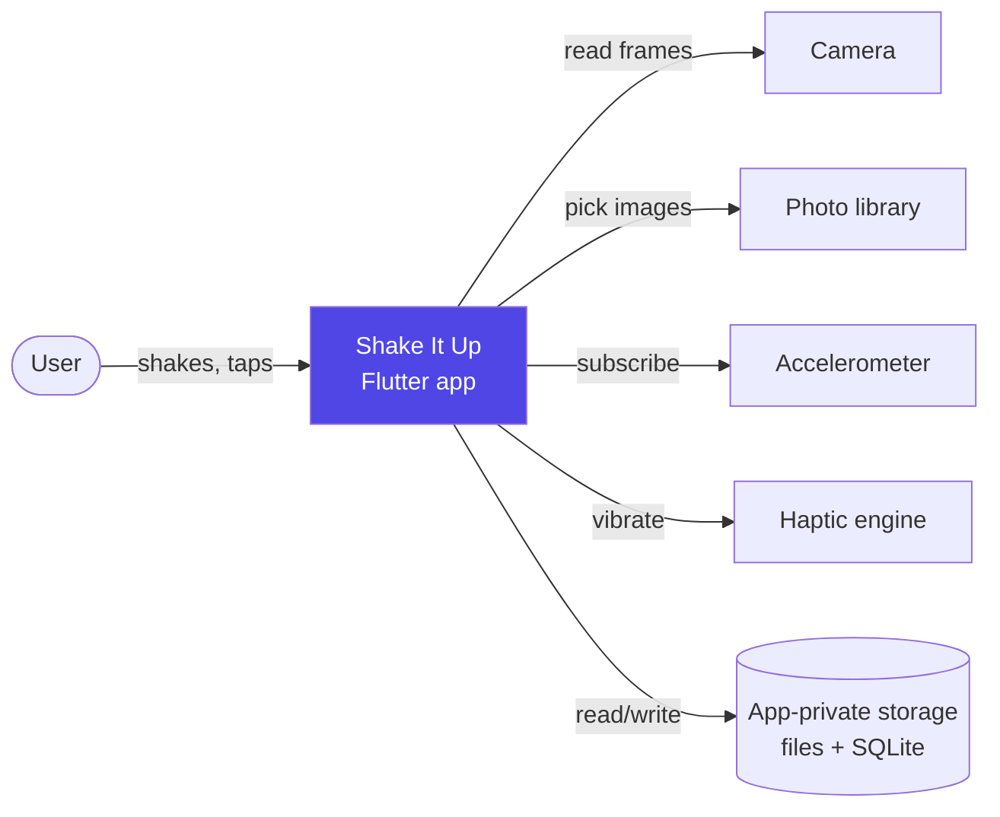
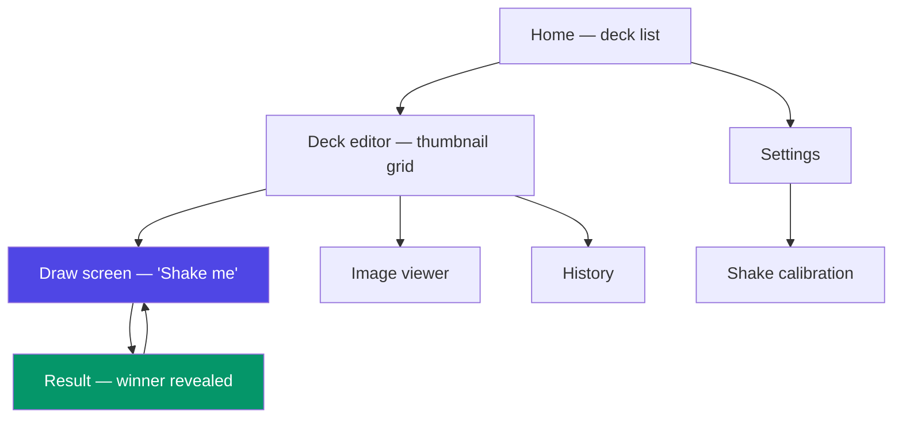
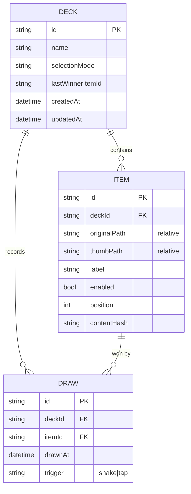

# Software Requirements Specification — Shake It Up

| Field | Value |
|---|---|
| Product | **Shake It Up** — shake your phone, let it pick for you |
| Document version | 1.0 (draft for review) |
| Status | Pre-implementation design |
| Platforms | Android, iOS (Flutter, single codebase) |
| Last updated | 2026-08-14 |

---

## 1. Introduction

### 1.1 Purpose

This document specifies the functional and non-functional requirements for **Shake It Up**, a mobile
application that lets a user build a set of images and then pick one at random by physically shaking
the device. It is the reference for implementation, test design, and acceptance. The companion
document [`ARCHITECTURE.md`](./ARCHITECTURE.md) specifies *how* these requirements are realised.

### 1.2 Scope

Shake It Up is a **fully offline, single-user, on-device** decision-making toy/utility. A user
groups images into a *deck* (e.g. photos of restaurants, team members, workout cards, gift options),
opens the deck, shakes the phone, and the app randomly reveals exactly one image from that deck.

**In scope for v1.0:**

- Creating, renaming, and deleting decks of images.
- Adding images from the device photo library (multi-select) and from the camera.
- Shake-triggered random selection, with a tap fallback.
- Configurable selection fairness (with/without repeats).
- Draw history per deck.
- Local persistence, offline-first, no account required.

**Explicitly out of scope for v1.0:** user accounts, cloud sync, sharing decks between users,
in-app purchases, ads, analytics telemetry, video/GIF items, web or desktop targets, wearables.
See §9 for the post-v1 backlog.

### 1.3 Definitions

| Term | Meaning |
|---|---|
| **Deck** | A named collection of images that are drawn from together. The unit of randomisation. |
| **Item** | One image inside a deck, with optional label and enabled/disabled state. |
| **Draw** | One random selection event producing exactly one winning item. |
| **Shake gesture** | A recognised back-and-forth device motion that triggers a draw (§3.3). |
| **Shuffle bag** | Draw-without-replacement pool: every item appears once before any repeats. |
| **Cooldown** | Period after a draw during which further shakes are ignored. |
| **Armed** | The draw screen state in which the accelerometer is being listened to. |

### 1.4 Intended audience

Developers implementing the app, QA designing test plans, and the product owner accepting the work.

### 1.5 References

- IEEE 830-1998 (structure inspiration, modernised)
- [`ARCHITECTURE.md`](./ARCHITECTURE.md) — technical design, ADRs, module breakdown
- Apple Human Interface Guidelines — Haptics, Photos access
- Android developer guidance — motion sensors, photo picker, scoped storage

---

## 2. Overall description

### 2.1 Product perspective

A greenfield, self-contained Flutter application. No backend, no server component, no third-party
service dependency at runtime in v1.0. The device's camera, photo library, accelerometer, haptic
engine, and local storage are the only external interfaces.

### 2.2 User classes

| Class | Description | Technical skill | Frequency |
|---|---|---|---|
| **Casual decider** (primary) | Wants a fast answer to "which one?" — lunch, movie, chore | Low | Bursty, a few times a week |
| **Repeat organiser** | Maintains stable decks (team standup order, workout cards, chores) | Low–medium | Daily |
| **Accessibility user** | Cannot reliably perform a shake gesture, or uses a screen reader | Any | Any |

The accessibility user is not an edge case: **every shake-triggered capability must have an equivalent
tap-triggered path** (FR-33).

### 2.3 Operating environment

| Item | Requirement |
|---|---|
| Android | 8.0 (API 26) and above; phones and tablets, portrait and landscape |
| iOS | 14.0 and above; iPhone and iPad |
| Framework | Flutter stable channel, Dart 3 (null-safe, sound) |
| Hardware | Requires a 3-axis accelerometer (universal on target devices) and a camera for capture flows |
| Connectivity | **None required.** All features work in airplane mode |

If a device reports no accelerometer, the app must degrade to tap-only mode rather than fail (FR-34).

### 2.4 Design and implementation constraints

- **C-1** Single Flutter codebase; no platform-specific feature forks beyond thin plugin channels.
- **C-2** No network permission declared in v1.0. Privacy is a product feature, not an afterthought.
- **C-3** Images are copied into app-private storage — the app must never depend on a URI it does
  not own, because the user can delete the source photo at any time (see ADR-004).
- **C-4** Stored file references must be **relative** paths; iOS app-container paths change between
  installs and OS updates, so absolute paths rot.
- **C-5** No image may be uploaded, transmitted, or backed up to a third party by the app itself.
- **C-6** Randomness must be injectable so tests are deterministic.

### 2.5 Assumptions and dependencies

- **A-1** The user grants camera permission only when they first use the camera flow; declining
  keeps the rest of the app fully usable.
- **A-2** Modern system photo pickers (Android Photo Picker, iOS `PHPicker`) return images without
  requiring a broad library permission; the app relies on this rather than requesting full access.
- **A-3** Typical deck sizes are 3–50 items; the app is specified to 500 (§4.2) but not optimised
  beyond that.
- **A-4** Device clock is used for history timestamps; no accuracy guarantee is offered.

---

## 3. Functional requirements

Priorities use MoSCoW: **M**ust / **S**hould / **C**ould. Everything marked **M** is v1.0 scope.

### 3.1 Deck management

| ID | Requirement | Pri |
|---|---|---|
| FR-01 | The user can create a deck with a name (1–60 chars). A default name (`Deck 1`, `Deck 2`, …) is pre-filled and editable. | M |
| FR-02 | The home screen lists all decks with name, item count, and a cover thumbnail, most-recently-used first. | M |
| FR-03 | The user can rename a deck. | M |
| FR-04 | The user can delete a deck. Deletion asks for confirmation, removes all its image files, and is undoable for 5 seconds via a snackbar. | M |
| FR-05 | The user can duplicate a deck (copies metadata and image files). | C |
| FR-06 | Deleting a deck must not orphan files: every file under the deck's directory is removed, and a startup sweep reclaims any strays. | M |
| FR-07 | The cover thumbnail is the first enabled item, or a placeholder when the deck is empty. | S |
| FR-08 | An empty deck shows an explanatory empty state with primary actions "Add from photos" and "Take photo". | M |

### 3.2 Image acquisition and item management

| ID | Requirement | Pri |
|---|---|---|
| FR-09 | The user can add images from the device photo library, selecting **multiple** in one pass. | M |
| FR-10 | The user can add an image by taking a photo with the camera, and can keep shooting without leaving the flow ("take another"). | M |
| FR-11 | Every added image is **copied** into app-private storage; the app never keeps a reference to an external URI. | M |
| FR-12 | On import, each image is (a) re-encoded to at most 2048 px on the longest edge, JPEG quality ≈85, (b) given a 512 px thumbnail, (c) EXIF orientation applied and all other EXIF — including GPS — stripped. | M |
| FR-13 | Import runs off the UI thread with visible progress ("3 of 12") and can be cancelled; already-imported items are kept. | M |
| FR-14 | If an individual image fails to import (corrupt, unreadable, out of space), the app reports which one failed and continues with the rest. | M |
| FR-15 | The deck editor shows items in a scrollable thumbnail grid. | M |
| FR-16 | The user can delete one or many items via multi-select, with confirmation and 5-second undo. | M |
| FR-17 | The user can give an item an optional text label (0–40 chars), shown with the result. | S |
| FR-18 | The user can **disable** an item without deleting it. Disabled items are visibly dimmed and are excluded from draws. | M |
| FR-19 | The user can reorder items by drag-and-drop (affects display only, never draw probability). | C |
| FR-20 | Tapping an item opens a full-screen viewer with swipe between items. | S |
| FR-21 | Duplicate detection: if an identical image (by content hash) is already in the deck, the app warns and lets the user skip or add anyway. | C |

### 3.3 Shake detection

| ID | Requirement | Pri |
|---|---|---|
| FR-22 | While the draw screen is visible and the app is in the foreground, the app listens to the accelerometer and recognises a deliberate shake. | M |
| FR-23 | Recognition requires **at least 3 direction reversals** whose linear-acceleration magnitude exceeds the sensitivity threshold, inside a 700 ms sliding window. A single jolt (setting the phone down, a bump in a bag) must not trigger a draw. | M |
| FR-24 | After a draw, shakes are ignored for a cooldown of 1200 ms, so one continuous shake produces exactly one result. | M |
| FR-25 | Sensitivity is user-configurable across three presets — Low / Medium / High — mapped to thresholds of approximately 15 / 12 / 9 m·s⁻². Default: Medium. | M |
| FR-26 | Settings offers a **calibration screen**: the user shakes, sees a live intensity meter and a hit/miss indicator, and adjusts sensitivity until it feels right. | S |
| FR-27 | The accelerometer subscription is released when the draw screen is left, when the app is backgrounded, and when the screen locks. It is re-established on resume. | M |
| FR-28 | The draw screen shows whether it is currently listening ("Shake me" vs. a cooldown/animation state), so the interaction is never ambiguous. | M |
| FR-29 | Shake-to-draw can be disabled globally in settings, leaving tap-to-draw. | S |

### 3.4 Random selection

| ID | Requirement | Pri |
|---|---|---|
| FR-30 | A draw selects exactly one item, uniformly at random from the deck's **enabled** items. | M |
| FR-31 | Three selection modes are offered per deck: **(a) Pure random** — independent draws; **(b) No immediate repeat** (default) — the previous winner is excluded while ≥2 items are enabled; **(c) Shuffle bag** — draw without replacement until every item has won once, then refill. | M |
| FR-32 | Shuffle-bag state persists across app restarts, and is reset when the deck's enabled-item set changes or the user taps "Reset bag". | M |
| FR-33 | A visible **"Draw" button** performs an identical draw without any shake. It is always present, never hidden behind a menu. | M |
| FR-34 | If the device has no accelerometer, or sensor access fails, the app shows tap-only mode with a one-time explanation instead of an error. | M |
| FR-35 | Drawing from an empty deck (0 enabled items) is blocked with a clear message and a shortcut to add images. A deck with exactly 1 enabled item always returns that item. | M |
| FR-36 | Selection must be statistically uniform: over 100 000 draws on a 10-item deck, each item's frequency stays within ±3 % of expectation (verified by automated test with a seeded RNG). *Revised during implementation: at 10 000 draws the ±3 % band is one standard deviation wide, so roughly a third of items would fall outside it by chance and the check would measure noise rather than fairness.* | M |
| FR-37 | Per-item weights (make some options more likely). | C |

### 3.5 Result presentation

| ID | Requirement | Pri |
|---|---|---|
| FR-38 | On a draw, the app plays a short suspense animation (rapidly cycling thumbnails, decelerating, ≈800 ms) before revealing the winner full-screen. | M |
| FR-39 | The reveal fires a haptic pulse and, if sound is enabled, a short sound. Both are individually switchable in settings; sound defaults **off**. | M |
| FR-40 | The result screen shows the winning image, its label if any, and actions: **Draw again**, **Back to deck**, **Share**. | M |
| FR-41 | The suspense animation is skipped by tapping, and is automatically reduced to a simple fade when the OS "reduce motion" setting is on. | M |
| FR-42 | "Draw again" is available directly from the result screen, and a shake while the result is showing (after cooldown) also re-draws. | M |
| FR-43 | Share exports the winning image via the system share sheet. | S |
| FR-44 | Total elapsed time from shake recognition to a fully revealed winner is ≤ 1.2 s including animation. | M |

### 3.6 History

| ID | Requirement | Pri |
|---|---|---|
| FR-45 | Every draw is recorded with deck, item, timestamp, and trigger (shake or tap). | M |
| FR-46 | Each deck has a history view: most recent first, thumbnail + label + relative time. | S |
| FR-47 | The user can clear a deck's history. | S |
| FR-48 | History is capped at the 200 most recent entries per deck; older entries are pruned automatically. | M |

### 3.7 Settings, onboarding, and app-wide

| ID | Requirement | Pri |
|---|---|---|
| FR-49 | First launch shows a ≤3-screen onboarding: what the app does, how to shake, and how to add images. Skippable and re-openable from settings. | S |
| FR-50 | Settings contains: shake sensitivity, shake enable/disable, haptics, sound, theme (system/light/dark), language, calibration, clear-all-data, and an about/version section. | M |
| FR-51 | Camera permission is requested **contextually** — at the moment the user taps "Take photo", never at launch — with a plain-language primer beforehand. | M |
| FR-52 | If a permission is permanently denied, the app explains the consequence and offers a deep link to system settings. It never dead-ends. | M |
| FR-53 | "Clear all data" deletes every deck, image, and history entry after an explicit confirmation. | M |
| FR-54 | The app is fully usable with only camera permission granted, or with none granted (photo picker requires none). | M |

---

## 4. Non-functional requirements

### 4.1 Performance

| ID | Requirement |
|---|---|
| NFR-01 | Cold start to interactive home screen ≤ 2.0 s on a mid-range reference device (Pixel 6a / iPhone 11). |
| NFR-02 | Shake recognised → suspense animation starts ≤ 100 ms. |
| NFR-03 | Draw computation itself ≤ 5 ms for decks up to 500 items. |
| NFR-04 | Thumbnail grid scrolls at ≥ 55 fps average with 200 items loaded. |
| NFR-05 | Importing 20 photo-library images completes in ≤ 8 s on the reference device, off the UI thread; the UI never blocks or drops below 30 fps during import. |
| NFR-06 | Accelerometer sampling at the game interval (~20 ms) must not measurably drain battery when the draw screen is closed — the subscription must be *absent*, not idle. |

### 4.2 Capacity

| ID | Requirement |
|---|---|
| NFR-07 | Supports at least 100 decks and 500 items per deck without functional degradation. |
| NFR-08 | Median stored size per imported image ≤ 600 KB (original + thumbnail) after re-encoding. |
| NFR-09 | The app surfaces a clear error and aborts the import cleanly when the device is out of storage — never a partially written or corrupt item. |

### 4.3 Reliability

| ID | Requirement |
|---|---|
| NFR-10 | Crash-free session rate ≥ 99.5 %. |
| NFR-11 | No data loss on force-quit: an item is visible in the deck only after both its file and its database row are committed. |
| NFR-12 | A missing image file (deleted out-of-band, restored backup) renders as a placeholder and is skipped by draws; it never crashes the grid or the draw. |
| NFR-13 | Database schema changes ship with migrations; no user data is dropped on upgrade. |

### 4.4 Usability and accessibility

| ID | Requirement |
|---|---|
| NFR-14 | Every shake-triggered action has an equivalent, always-visible touch control. |
| NFR-15 | All interactive elements carry semantic labels and meet a ≥ 48×48 dp touch target. |
| NFR-16 | Text contrast meets WCAG 2.1 AA (4.5:1 body, 3:1 large). |
| NFR-17 | Layout survives system font scaling up to 200 % without clipping or overlap. |
| NFR-18 | Screen readers announce the drawn result ("Selected: <label or 'image 4 of 12'>") via a live region. |
| NFR-19 | Honour the OS reduce-motion setting for all non-essential animation. |
| NFR-20 | The core loop — open deck, shake, see result — is reachable in ≤ 2 taps from app launch for the most recent deck. |

### 4.5 Privacy and security

| ID | Requirement |
|---|---|
| NFR-21 | No network calls whatsoever in v1.0. The Android manifest declares no `INTERNET` permission. |
| NFR-22 | Images live in app-private storage, not the shared gallery, and are not world-readable. |
| NFR-23 | GPS and other identifying EXIF metadata are stripped on import. |
| NFR-24 | Images are excluded from automatic iCloud/Android cloud backup by default (opt-in later if desired). |
| NFR-25 | No analytics, tracking, or advertising SDK is bundled in v1.0. |
| NFR-26 | The store listing and an in-app privacy note state plainly: photos never leave the device. |

### 4.6 Maintainability and portability

| ID | Requirement |
|---|---|
| NFR-27 | ≥ 80 % line coverage on domain and service layers; the shake detector and selection engine are covered by dedicated unit tests with recorded/synthetic sensor traces. |
| NFR-28 | Business logic contains no Flutter widget imports, so it is testable without a device. |
| NFR-29 | All user-facing strings live in ARB localisation files — no hardcoded literals in widgets. |
| NFR-30 | English and Arabic ship in v1.0, with correct RTL mirroring. |
| NFR-31 | CI runs `flutter analyze`, `dart format --set-exit-if-changed`, and the full test suite on every push; a red pipeline blocks merge. |

---

## 5. External interfaces

### 5.1 User interface

Six screens; Material 3 with a dynamic-colour-capable theme.

The **draw screen is the product**. It must be visually calm, unmistakably say what to do, and put
the tap-fallback button in reach without competing with the shake affordance.

### 5.2 Hardware interfaces

| Interface | Use | Notes |
|---|---|---|
| Accelerometer | Shake detection | ~50 Hz sampling; subscribed only while armed |
| Camera | Photo capture | Via the system camera activity/controller, not a custom preview in v1.0 |
| Haptic engine | Result feedback | Medium-impact pulse on reveal |

### 5.3 Software interfaces

| Interface | Purpose |
|---|---|
| System photo picker | Multi-select image import without broad library permission |
| System share sheet | Sharing the winning image |
| SQLite (on-device) | Deck, item, history, and bag-state persistence |
| App-private file system | Image originals and thumbnails |

### 5.4 Communications interfaces

None. v1.0 has no network interface of any kind.

---

## 6. Primary use cases

### UC-1 — Build a deck and draw a winner (happy path)

**Actor:** Casual decider · **Precondition:** App installed, no deck yet

1. User opens the app and taps **New deck**; names it "Lunch".
2. User taps **Add from photos**, multi-selects 8 restaurant photos, confirms.
3. App imports off-thread with progress, showing thumbnails as they land.
4. User taps **Shake it**. The draw screen arms the accelerometer.
5. User shakes the phone.
6. App recognises the gesture, plays the suspense reel, reveals one photo, fires a haptic pulse.
7. User taps **Draw again** or returns to the deck.

**Alternate flows:** (2a) User taps **Take photo** instead and captures images one by one.
(5a) User cannot shake and taps **Draw** — identical result path. (6a) Deck has 0 enabled items →
draw is blocked with a shortcut to add images.

### UC-2 — Avoid repeats across a session

**Actor:** Repeat organiser · **Goal:** Assign a standup order without repeats

1. User opens the "Team" deck, sets selection mode to **Shuffle bag**.
2. User shakes once per person; each draw returns someone not yet drawn.
3. After the last member, the app announces the bag is empty and refills it.
4. User taps **Reset bag** any time to start over.

### UC-3 — Accidental-trigger avoidance

**Actor:** Any user · **Goal:** Not get spurious draws

1. User puts the phone down firmly while the draw screen is open.
2. The single acceleration spike does not meet the 3-reversal rule (FR-23) — no draw occurs.
3. User backgrounds the app; the sensor subscription is released (FR-27).

---

## 7. Data requirements

Conceptual model — the physical schema is specified in [`ARCHITECTURE.md`](./ARCHITECTURE.md) §5.

**Retention:** decks and items live until the user deletes them; history is capped at 200 rows per
deck (FR-48). **Integrity:** deleting a deck cascades to its items, history, and files (FR-06).

---

## 8. Acceptance criteria

v1.0 is accepted when:

1. Every **M**-priority requirement in §3 is implemented and demonstrated on both a physical Android
   device and a physical iPhone.
2. All NFR thresholds in §4 are measured — not estimated — on the reference devices and recorded.
3. Automated tests cover: shake recognition (positive and negative traces, including the
   "set the phone down" trace), uniformity of selection (FR-36), shuffle-bag exhaustion,
   import failure handling, and deck-deletion file cleanup.
4. A full manual pass over UC-1 to UC-3 with camera permission granted, denied, and permanently
   denied produces no dead ends.
5. VoiceOver and TalkBack can complete UC-1 end-to-end using only the tap path.
6. A static check confirms the release build declares no network permission and bundles no
   analytics SDK.

---

## 9. Post-v1 backlog

Ordered by expected value, not commitment:

| Idea | Notes |
|---|---|
| Per-item weights | FR-37; changes the selection engine from uniform to weighted-alias sampling |
| Text-only items | Same engine, no image — widens the audience considerably |
| Multi-deck draw | "Pick one from each of these decks" — outfits, meal combos |
| Deck export/import | A single archive file; the natural precursor to any sharing feature |
| Cloud sync | Requires accounts and a backend; re-opens every privacy claim in §4.5 |
| Home-screen widget / watch app | Shake-to-draw without opening the app |
| Elimination mode | Remove the winner from the deck permanently — tournaments, raffles |
| Sound packs and result themes | Cosmetic depth |

---

## 10. Risks

| ID | Risk | Impact | Mitigation |
|---|---|---|---|
| R-1 | Shake feels too sensitive or too dull; the core interaction disappoints | High | Presets + calibration screen (FR-25/26); tune against recorded traces from ≥3 device classes before release |
| R-2 | Users perceive the result as "not random" after a repeat | Medium | "No immediate repeat" is the *default* mode (FR-31b); history view makes the distribution visible |
| R-3 | Photo permission model differs across OS versions and shifts over time | Medium | Route everything through the system picker; never request broad library access (A-2) |
| R-4 | Large decks bloat storage | Medium | Re-encode on import (FR-12), publish per-deck size in settings |
| R-5 | Accelerometer behaviour varies by OEM | Medium | Normalise to gravity-removed magnitude, not raw axes (ARCHITECTURE §4); device test matrix |
| R-6 | Scope creep into sync/sharing before the core loop is polished | High | §9 is explicitly deferred; v1.0 acceptance is §8 only |

---

## 11. Traceability

Requirement → owning component. Components are defined in [`ARCHITECTURE.md`](./ARCHITECTURE.md) §3.

| Requirement group | Owning component(s) |
|---|---|
| FR-01 – FR-08 (decks) | `features/decks` · `DeckRepository` · `AppDatabase` |
| FR-09 – FR-21 (images/items) | `features/capture` · `ImageImportService` · `ImageStorage` · `Thumbnailer` |
| FR-22 – FR-29 (shake) | `services/sensors/ShakeDetector` · `DrawController` |
| FR-30 – FR-37 (selection) | `domain/draw/SelectionEngine` · `RandomSource` · `BagStateRepository` |
| FR-38 – FR-44 (result) | `features/draw` presentation · `HapticsService` |
| FR-45 – FR-48 (history) | `features/history` · `HistoryRepository` |
| FR-49 – FR-54 (settings) | `features/settings` · `SettingsRepository` · `PermissionService` |
| NFR-01 – NFR-09 | Isolate-based import, lazy grid, DB indices |
| NFR-14 – NFR-20 | Presentation layer + `l10n` |
| NFR-21 – NFR-26 | `ImageStorage` (app-private, EXIF strip), build configuration |
| NFR-27 – NFR-31 | Test suite + CI workflow |
